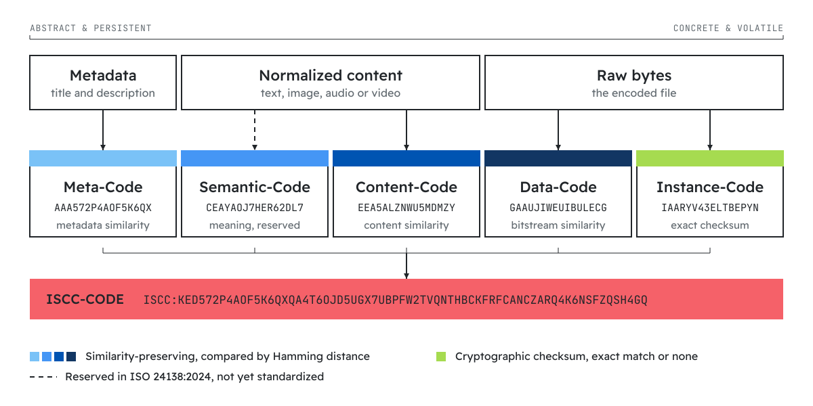
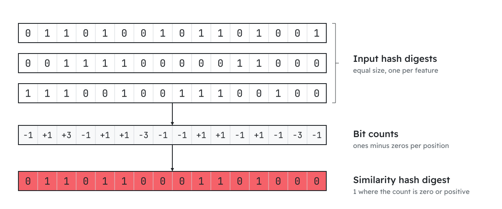
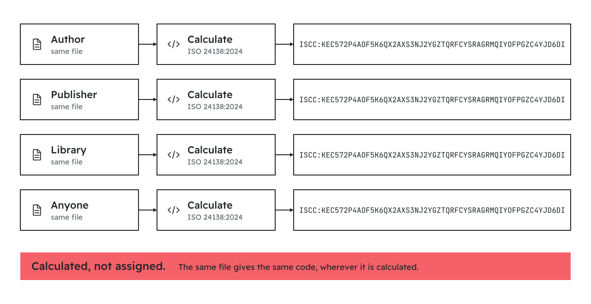

# ISCC - Capabilities

The **ISCC** is a content-derived, multi-component, similarity-preserving identifier and fingerprint
for digital content, standardized as **ISO 24138:2024**. Because it is computed from the content
itself, independent parties can derive the same code from the same asset. The capabilities below
follow from that design.

## Multi-layer content identification

<div class="iscc-cols" markdown>

{ .left }

An **ISCC-CODE** is a made of several **ISCC-UNITs**, each using a distinct algorithm and capturing a different layer of identity. An ISCC-CODE contains at minimum a Data-Code and an Instance-Code. The units are
self-describing and can also be used in isolation.

</div>

- **Meta-Code**: similarity of the descriptive **metadata**, such as the title and description.
- **Semantic-Code**: conceptual similarity of the **meaning** of the content, independent of its
  exact wording or encoding (reserved in ISO 24138:2024; no standardized algorithm yet - see below).
- **Content-Code**: perceptual and structural similarity of the **content**, with dedicated
  algorithms for the Text, Image, Audio, and Video modalities.
- **Data-Code**: similarity of the raw **data**, the encoded bitstream of the file.
- **Instance-Code**: exact **data identity**: a cryptographic checksum of the bytes.

!!! note "Semantic-Code"
    ISO 24138:2024 reserves a MainType for **Semantic-Codes** (conceptual similarity) but does not
    yet define an algorithm for them. Experimental implementations exist for text
    ([iscc-sct](https://github.com/iscc/iscc-sct)) and images
    ([iscc-sci](https://github.com/iscc/iscc-sci)).

## Similarity-preserving fingerprints

<div class="iscc-cols" markdown>

{ .left }

Each ISCC-UNIT, except for the Instance-Code, is a **similarity-preserving** hash: similar inputs produce codes that are close in
[Hamming distance](https://en.wikipedia.org/wiki/Hamming_distance). Likeness can therefore be
estimated by comparing codes directly, without access to the original files.

Because similarity is preserved **independently per layer**, comparing the individual units shows
*how* two assets relate:

</div>

- Matching **Content-Code**, differing **Data-Code** and **Instance-Code** → the same work in a
  different encoding, such as a re-compressed image.
- Matching **Data-Code**, differing **Instance-Code** → near-identical files with a small byte-level
  change.
- Matching **Instance-Code** → bit-for-bit identical files.

This supports near-duplicate detection, deduplication, clustering, and integrity checks from the
codes alone.

## Decentralized, algorithmic generation

<div class="iscc-cols" markdown>

{ .left }

ISCCs are **generated from the content**, not assigned by an authority. No registration, account, or
central database is involved: anyone with the open-source software and the asset derives the same
code. Generation is implemented in [iscc-core](https://github.com/iscc/iscc-core), the ISO 24138
reference implementation, and the higher-level [iscc-sdk](https://github.com/iscc/iscc-sdk).

</div>

## Data integrity and exact matching

The **Instance-Code** is a cryptographic hash of the raw bytes. Any single-bit change produces a
completely different Instance-Code, which makes it a reliable check for **data integrity** and
bit-exact identity. The **Data-Code**, by contrast, is a soft similarity hash designed to survive
minor modifications. Together they distinguish an identical file from a merely similar one.

## Robust across formats

The **Content-Code** is derived from the decoded, normalized content rather than the file bytes, so
it is **robust to format conversion, re-compression, resizing, and minor edits**. Different encodings
of the same work produce identical or closely matching Content-Codes, which lets an ISCC connect
related formats, such as PDF, EPUB, and Word files, or JPEG and PNG images, without relying on
filenames or external metadata.

## Granular content identification

Beyond one code per layer, the ISCC ecosystem supports **SIMPRINTS**: headerless similarity hashes
that describe individual *segments* of a work, such as a paragraph, an image region, or a scene.
SIMPRINTS enable fine-grained matching like partial overlap, quotation, and paraphrase detection.

Granular features are **not packed into the ISCC-CODE**. The ISCC-CODE stays a single, fixed-size,
document-level descriptor; the segment-level SIMPRINTS can optionally be recorded **alongside it in the ISCC
metadata** as a `features` list, each entry carrying the `offset` and `size` that locate it in the
original content. The work and its parts are linked by association within one metadata record, not by
nesting the parts inside the code.

```json
{
  "iscc": "ISCC:KACZH265WE3KJOSR...",
  "units": ["ISCC:AADZH265WE3KJOSR...", "ISCC:EADUZ5XBKQCWGG4H...", "..."],
  "features": [
    {
      "maintype": "content",
      "subtype": "text",
      "simprints": ["8IAnFvInk24iEkDG...", "GH7W703iOzPEyhD2..."],
      "offsets": [0, 698],
      "sizes": [698, 469]
    }
  ]
}
```

The document-level `iscc` and `units` describe the whole work; the `features` list locates each
segment within it.

!!! note "Status"
    SIMPRINTS and Semantic-Codes are **experimental** and not yet part of ISO 24138. The granular
    text and image implementations are [iscc-sct](https://github.com/iscc/iscc-sct) and
    [iscc-sci](https://github.com/iscc/iscc-sci).

## Versioning and variant detection

Because the codes preserve similarity, an ISCC can track **versions and variants** of a work over
time. Comparing Content-Codes places two assets on a similarity scale, measured as the share of
matching bits across the 64-bit code body, while the Instance-Code separates an exact duplicate from
a near-duplicate. This helps spot edits, watermarked copies, and re-releases.

## Timestamping and provenance

The in-development **ISCC-ID** binds an ISCC-CODE to a verifiable point in time. It is issued by an **ISCC-HUB** in
response to a signed declaration and returned with a signed receipt; integrity rests on an
append-only transparency log and standard [RFC 3161](https://www.rfc-editor.org/rfc/rfc3161)
or [OpenTimestamps](https://opentimestamps.org/) based timestamping. This provenance layer does not require registering the
ISCC on any distributed ledger. It also makes the ISCC a useful soft-binding identifier for content
provenance and authenticity workflows, such as [C2PA](https://c2pa.org/).

!!! note "Status"
    The ISCC-ID and the surrounding discovery protocol are under active development and are **not yet
    part of ISO 24138:2024**.

## Cross-sector and complementary

The ISCC works across text, image, audio, and video, which makes it applicable wherever digital
content is produced, processed, or distributed: journalism, books, music, film, science, and more. It makes existing identifiers such as ISBN, ISRC, and DOI discoverable by content rather than replacing them.
