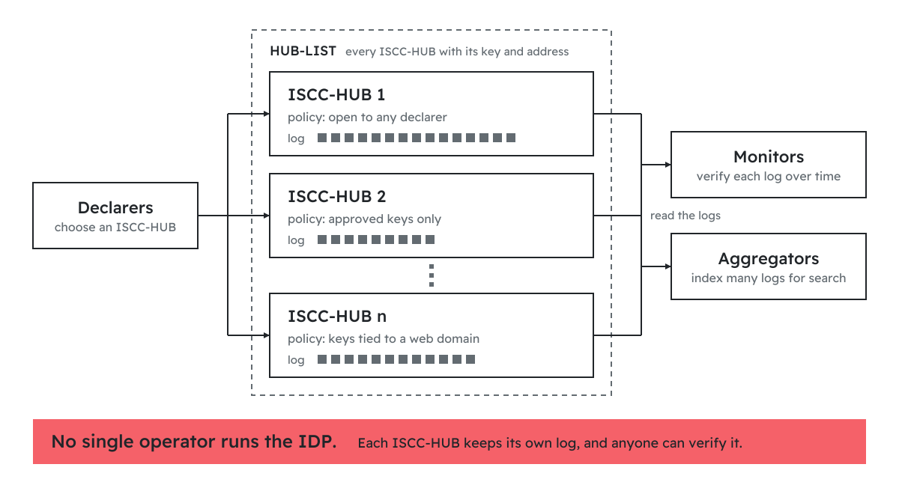

# ISCC - Discovery Protocol

The ISCC was first published in 2017 as an
[open proposal](https://github.com/iscc/iscc-codes/blob/abf99ffe23bc03765161e2d8d967bdb20fc7afcf/docs/concept.md)
to the community: a common code for digital content, derived from the content itself.
In 2024 that code became an International Standard, [ISO 24138:2024](https://www.iso.org/standard/77899.html). 
{ .iscc-lead }

The **ISCC Discovery Protocol (IDP)** is our next open proposal. It describes how anyone can start from a piece of digital content and find out who has declared it, when, and where to find its metadata and
services. We share it as a draft to start a conversation with creators, publishers, journalists,
libraries, archives, registries, rights organizations, AI developers, researchers, and everyone
else who works with digital content.
{ .iscc-lead }

!!! note "Status: draft"
    The IDP is specified in a set of ISCC Enhancement Proposals ([see below](#specifications)).
    Its core specifications are drafted as input to ISO/TC 46/SC 9/WG 18 for a future revision
    of ISO 24138. The IDP is **not part of ISO 24138:2024**. A reference ISCC-HUB is in
    operation at [iscc.id](https://iscc.id).

## Why a discovery protocol

An ISCC-CODE describes content and nothing else. It does not say who created it, who holds rights in it, or where its metadata can be found. This is by design: the 2017 proposal and ISO 24138:2024 kept ownership and location out of the code and left them to a separate layer. It defines how a code is derived, but not how to get from a code to such information.

That information exists, but it is spread across many registries - for books, music, film,
research, images, and archives - and each is reachable by different means and identifiers. Someone
who holds nothing but a file has no common way to discover metadata.

!!! abstract "In short"
    Without an identifier, metadata stays out of reach. With the IDP, the content itself leads to it.

The IDP adds this missing layer. Generating an ISCC-CODE stays local
and needs no registration. Declaring it is a separate, optional step. A declaration creates timestamped, verifiable evidence of who declared the content and when, and links the content to its metadata and services.

## Declare, then discover

A **declaration** is a short, signed statement: *this ISCC-CODE applies to this content, and its
metadata and services can be found here.* The declarer signs it with a key pair they generate
themselves and submits it to an **ISCC-HUB** of their choice. The ISCC-HUB checks the
message and its signature, issues an **ISCC-ID**, records the declaration in a public
transparency log, and provides a signed receipt.

Each declaration binds four pieces of information:

| Question  | Answered by                                                                    |
| --------- | ------------------------------------------------------------------------------ |
| **Who**   | the declarer's public key, optionally linked to a web domain or other identity |
| **When**  | the time of declaration, assigned by the ISCC-HUB to the microsecond           |
| **What**  | the ISCC-CODE and a cryptographic hash of the content                          |
| **Where** | an optional link to a gateway for metadata and services                        |

ISCC-HUBs store no descriptive metadata. Metadata stays with the declarer or with the registry
that holds it. A declaration only points to it, and can commit to its exact state at the time of
declaration with a hash.

## ISCC-CODE and ISCC-ID

The IDP adds a second kind of ISCC. The two answer different questions:

|              | ISCC-CODE                                        | ISCC-ID                                         |
| ------------ | ------------------------------------------------ | ----------------------------------------------- |
| Answers      | What is this content, and what is it similar to? | Who declared this content, and when?            |
| Origin       | computed from the content, by anyone             | issued by an ISCC-HUB for one declaration       |
| Same content | always gives the same ISCC-CODE                  | gets a different ISCC-ID with every declaration |
| Requires     | open software only                               | a signed declaration to an ISCC-HUB             |
| Specified in | ISO 24138:2024                                   | IEP-0011 (draft)                                |

An ISCC-ID has 64 bits: a 52-bit timestamp and the 12-bit HUB-ID of the ISCC-HUB that issued
it. It is short, globally unique, sorts by time, and names the ISCC-HUB that can resolve it. For
example, [`ISCC:MEIGKV5N6NTVF4AB`](https://iscc.id/ISCC:MEIGKV5N6NTVF4AB?redirect=false) was issued by ISCC-HUB 1 at 2026-06-30T16:14:39.523119Z.

When a photographer and a picture agency both declare the same image, each receives its own
ISCC-ID, attributed to its own key. Both declarations carry the same ISCC-CODE, so a search by
content finds both.

## Three layers

The IDP separates three functions:

- **ISCC-HUBs** handle declaration and timestamping. They issue ISCC-IDs and publish transparency
  logs that anyone can read and verify. They stay lean and neutral and store no descriptive
  metadata.
- **Gateways** handle routing. Given an ISCC-ID, a gateway lists the metadata and services
  available for the content, as a W3C Controlled Identifier Document. A gateway holds no data of
  record, so it can change without invalidating the declaration.
- **Registries** hold the metadata. They keep authority over their records, apply their own
  schemas and verification rules, and offer services. Existing
  registries keep their identifiers and their role; the IDP makes them discoverable from the
  content.

The separation is functional, not organizational. A single operator can combine all three
functions or run only one of them. A registry, for example, can run its own ISCC-HUB and
gateway, or rely on those run by others.

## Three ways to discover

- **By ISCC-ID.** The HUB-ID inside the ISCC-ID names the issuing ISCC-HUB, and the public
  HUB-LIST gives its address. The ISCC-HUB returns the declaration, and its gateway link leads on
  to metadata and services.
- **By identical file.** From a file, anyone can compute its ISCC-CODE and content hash and find
  declarations of exactly that file, by any declarer.
- **By similar content.** Declarations carry full-length, 256-bit ISCC-UNITs. Search services
  index them across ISCC-HUBs, so that re-encoded, resized, or edited versions of a work can be
  found from any one of them.

## A polycentric network

The IDP runs on independent ISCC-HUBs - up to 4,096 in the
operational network - each listed in a public HUB-LIST. Each ISCC-HUB writes only its own log and
depends on no other ISCC-HUB. Around them, others observe:

- **Monitors** verify each log over time and detect rewritten histories.
- **Aggregators** read the logs of many ISCC-HUBs and build network-wide indexes for lookup and
  similarity search.
- **Anyone** can verify a log with standard tools for transparency logs.

Each operator sets and announces the policies and fees of its own ISCC-HUB: open to any
declarer, limited to approved keys, or with extra requirements such as an identity tied to a web
domain. Such policies can only narrow what the protocol allows, never extend it. Public-interest
and commercial operators can run ISCC-HUBs side by side.

How ISCC-HUBs join the HUB-LIST, how they announce their policies, and how the list is governed
are part of this proposal and open for discussion.

## Trust through transparency

**The protocol is open. Trust is configured.** The IDP itself does not limit who may declare
what. Creators and publishers have reasons to identify content, and so do libraries, archives,
distributors, platforms, researchers, and users. The IDP therefore makes no assumptions about
authorship or rights. It records who declared what, and when. A declaration is not a proof of
ownership, but it is a proof of existence: timestamped, verifiable evidence that the content
existed by the time of declaration, and that a specific key claimed it.

Trust is configured at two points. Each ISCC-HUB decides who may declare there and announces its
policy. Each participant decides which ISCC-HUBs it relies on:

=== "Curated registry"

    An institution runs its own ISCC-HUB, accepts declarations only from approved keys, and
    relies only on its own records.

    **It works like a central registry, but its records can be discovered from the content
    anywhere.**

=== "Sector federation"

    A consortium or sector curates its own subset of ISCC-HUBs, and monitors and indexes only
    those.

    **The federation decides. Nobody outside it has to agree.**

=== "Open network"

    A search service indexes every public log and finds declarations across the whole network.

    **Indexing is not endorsing. The log shows who claimed what, and when.**

**Conflicts stay visible.** Different parties may declare the same content with conflicting
claims. The IDP does not decide between them. It keeps every claim public, attributed to a key,
and ordered in time, so that courts, arbitrators, registries, or communities have verifiable
evidence when they need to decide. A false claim does not disappear; it stays attributed to
whoever made it. Trust builds over time, through keys tied to known domains, consistent
declarations, and registries with transparent policies.

**Records can be checked without trusting the ISCC-HUB.**

- Every declaration carries the declarer's digital signature.
- Every ISCC-HUB keeps an append-only transparency log, built like the logs that Certificate
  Transparency uses for web certificates. Anyone can check that a declaration is in the log and
  that the log has never been rewritten.
- The signed receipt proves the declaration without contacting the ISCC-HUB.
- Independent monitors follow the logs and raise an alarm if an ISCC-HUB alters its history.

**Deletion leaves a trace.** Only the key that made a declaration can delete it. The deletion is
recorded as a new log entry and the original entry remains, so the history "declared, then
deleted" stays verifiable.

## Built on open standards

The IDP builds on established specifications rather than inventing its own:

- **Signatures:** Ed25519 ([RFC 8032](https://www.rfc-editor.org/rfc/rfc8032)) over JSON
  canonicalized with JCS ([RFC 8785](https://www.rfc-editor.org/rfc/rfc8785))
- **Identity:** W3C [Decentralized Identifiers](https://www.w3.org/TR/did-1.0/) (did:web) and
  [Controlled Identifiers](https://www.w3.org/TR/cid-1.0/)
- **Receipts:** W3C [Verifiable Credentials](https://www.w3.org/TR/vc-data-model-2.0/)
- **Logs:** the Certificate Transparency Merkle tree
  ([RFC 6962](https://www.rfc-editor.org/rfc/rfc6962)), published in the
  [C2SP tlog-tiles](https://c2sp.org/tlog-tiles) format

The ISCC is also registered with the Coalition for Content Provenance and Authenticity
([C2PA](https://c2pa.org/)) as the soft binding algorithm `io.iscc.v0`. A soft binding lets a
content credential be found again from the content itself, after the credential has been removed
from the file or the file has been re-encoded. [IEP-0020](https://ieps.iscc.codes/iep-0020/)
specifies its value format: full-length, 256-bit ISCC-UNITs, as carried by IDP declarations.

## Specifications

All specifications are drafts and are developed in the open at
[ieps.iscc.codes](https://ieps.iscc.codes).

| IEP                                           | Title                   | Specifies                                                      |
| --------------------------------------------- | ----------------------- | -------------------------------------------------------------- |
| [IEP-0013](https://ieps.iscc.codes/iep-0013/) | ISCC Discovery Protocol | declarations, deletions, ISCC-HUB interface, replay protection |
| [IEP-0011](https://ieps.iscc.codes/iep-0011/) | ISCC-ID                 | structure, encoding, and issuance of the ISCC-ID               |
| [IEP-0014](https://ieps.iscc.codes/iep-0014/) | ISCC Transparency Log   | log records, checkpoints, and their verification               |
| [IEP-0019](https://ieps.iscc.codes/iep-0019/) | ISCC Signature          | the signature format for IDP messages and other JSON documents |
| [IEP-0020](https://ieps.iscc.codes/iep-0020/) | ISCC C2PA Conformance   | ISCC soft bindings in C2PA manifests                           |

## Implementations

| Role                  | Open-source software                                 | Online                                                                                                                        |
| --------------------- | ---------------------------------------------------- | ----------------------------------------------------------------------------------------------------------------------------- |
| ISCC-HUB              | [iscc-hub](https://github.com/iscc/iscc-hub)         | [iscc.id](https://iscc.id) and the other hubs in the [HUB-LIST](https://github.com/iscc/iscc-hub/blob/main/hubs/mainnet.yaml) |
| Monitor               | [iscc-monitor](https://github.com/iscc/iscc-monitor) | in-browser log verifier at [monitor.iscc.codes](https://monitor.iscc.codes)                                                   |
| Aggregator and search | [iscc-search](https://github.com/iscc/iscc-search)   | documentation at [search.iscc.codes](https://search.iscc.codes)                                                               |
| Message schemas       | [iscc-schema](https://github.com/iscc/iscc-schema)   | documentation at [schema.iscc.codes](https://schema.iscc.codes)                                                               |
| Signatures            | [iscc-crypto](https://github.com/iscc/iscc-crypto)   | documentation at [crypto.iscc.codes](https://crypto.iscc.codes)                                                               |

## Take part

The IDP is developed in the open. This proposal is meant to be discussed, tested, and improved:

- **Comment** on a specification through the GitHub issue linked at the top of each IEP, for
  example [IEP-0013](https://github.com/iscc/iscc-ieps/issues/18).
- **Try** the reference ISCC-HUB at [iscc.id](https://iscc.id), or verify a log at
  [monitor.iscc.codes](https://monitor.iscc.codes).
- **Run** an ISCC-HUB, a monitor, or a gateway, or connect your registry: contact the
  [ISCC Foundation](https://iscc.io/get-involved).
