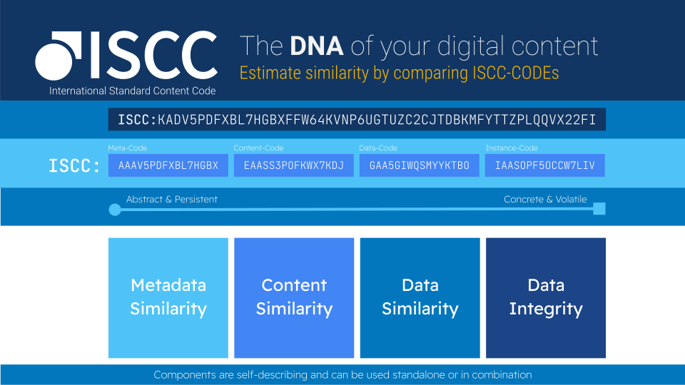

# ISCC — International Standard Content Code

## Open, decentralized content identification — derived from the content itself

**ISCC** ([ISO 24138:2024](https://www.iso.org/standard/77899.html)) is an open standard for content
identification that works directly from the digital file. Generate a compact, similarity-preserving
code for any text, image, audio, or video. Anyone can derive the same **ISCC-CODE** from the same
content, with no registry and no assignment step.

[Learn how it works](concept.md){ .iscc-btn .iscc-btn--primary }
[Try it live](https://demo.iscc.io){ .iscc-btn }

*Open source · ISO 24138:2024 · maintained by the [ISCC Foundation](https://iscc.io)*

## Find your path

### Developers

Generate and manage **ISCC-CODEs** from media files in Python or over REST.

[Explore the software →](resources.md)

### Researchers & technologists

Understand the algorithms and the similarity-preserving design behind the codes.

[Read the concept →](concept.md)

### Standards & policy

See how the ISCC relates to ISO 24138 and to established identifiers like ISBN, ISRC, and DOI.

[Read the specification →](specification.md)

## One code, derived from the bytes themselves

Most identifiers (ISBN, ISRC, DOI) are assigned by an authority and attached to a work. The ISCC
inverts this: anyone can compute the code directly from the digital content using open algorithms.
The same content always produces the same code, even after re-encoding or compression, and similar
content produces similar codes.

The ISCC complements existing identifiers rather than replacing them. An ISBN identifies an abstract
product, such as a specific edition of a publication; an ISCC is computed from a file and tells you
whether two files are the same content, and how similar they are. [Read more in the Concept →](concept.md)

## How it works

An **ISCC-CODE** is a composite, hierarchically structured fingerprint. It combines several
content-derived **ISCC-UNITs** covering embedded metadata, normalized content, and the raw bytes.
Each unit is a compact, similarity-preserving hash.

[See the full specification →](specification.md)

## Try it

- **Web demo:** <https://demo.iscc.io>
- **Playground:** <https://huggingface.co/spaces/iscc/iscc-playground>

## Developer entry points

- [**iscc-core**](https://github.com/iscc/iscc-core) — Python reference implementation of the ISO 24138 core algorithms
- [**iscc-sdk**](https://github.com/iscc/iscc-sdk) — high-level Python toolkit for generating ISCCs from media files

See the [Resources](resources.md) page for the wider ISCC ecosystem of tools and services.

!!! note "ISCC Standard — ISO 24138:2024"
    The ISCC is published as [ISO 24138:2024](https://www.iso.org/standard/77899.html) by
    ISO/TC 46/SC 9. Current implementation guidance lives at
    [core.iscc.codes](https://core.iscc.codes) and [sdk.iscc.codes](https://sdk.iscc.codes).
